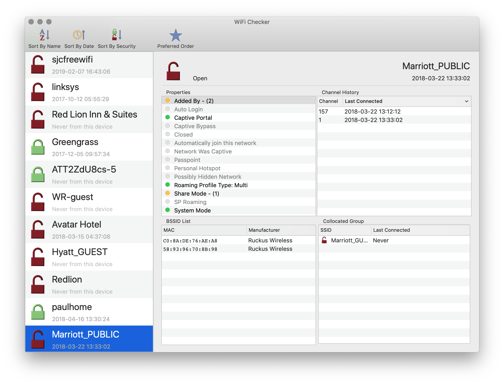

# WiFi Checker

WiFi Checker reads the `com.apple.airport.preferences.plist` and pulls the information out and attempts to present it in a somewhat readable fashion.  (As I don't think I need to point out, I'm not a UI/UX designer)

A fun little side project that tells you all the places your Mac has been.  Depending on how you have iCloud set up, it does appear that a number of your iOS WiFi connections can show up in this list as well.  

